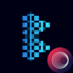
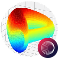
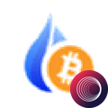
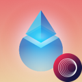
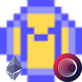
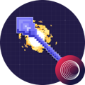

# logos

by source chain:
* [Solana](#source-chain-solana)
* [Ethereum](#source-chain-ethereum)
* [BSC](#source-chain-bsc)
* [Terra](#source-chain-terra)
* [Polygon](#source-chain-polygon)
* [Avalanche](#source-chain-avalanche)
* [Oasis](#source-chain-oasis)
* [Algorand](#source-chain-algorand)
* [Fantom](#source-chain-fantom)
* [Aurora](#source-chain-aurora)
* [Karura](#source-chain-karura)
* [Acala](#source-chain-acala)
* [Klaytn](#source-chain-klaytn)
* [Celo](#source-chain-celo)
* [Near](#source-chain-near)
* [Moonbeam](#source-chain-moonbeam)
* [Terra2](#source-chain-terra2)
* [Injective](#source-chain-injective)
* [XPLA](#source-chain-xpla)
* [Optimism](#source-chain-optimism)
* [Arbitrum](#source-chain-arbitrum)
* [Aptos](#source-chain-aptos)

## source chain: Solana
### RAY


```
https://raw.githubusercontent.com/certusone/wormhole-token-list/main/assets/RAY_wh.png
```

### SBR


```
https://raw.githubusercontent.com/certusone/wormhole-token-list/main/assets/SBR_wh.png
```

### SOL


```
https://raw.githubusercontent.com/certusone/wormhole-token-list/main/assets/SOL_wh.png
```

### SRMso


```
https://raw.githubusercontent.com/certusone/wormhole-token-list/main/assets/SRMso_wh.png
```

### USDCso


```
https://raw.githubusercontent.com/certusone/wormhole-token-list/main/assets/USDCso_wh.png
```

### USDTso


```
https://raw.githubusercontent.com/certusone/wormhole-token-list/main/assets/USDTso_wh.png
```

### mSOL


```
https://raw.githubusercontent.com/certusone/wormhole-token-list/main/assets/mSOL_wh.png
```

### ZBC


```
https://raw.githubusercontent.com/certusone/wormhole-token-list/main/assets/ZBC_wh.png
```

### XTAG


```
https://raw.githubusercontent.com/certusone/wormhole-token-list/main/assets/XTAG_wh.png
```

### KING


```
https://raw.githubusercontent.com/certusone/wormhole-token-list/main/assets/KING_wh.png
```

### BONK


```
https://raw.githubusercontent.com/certusone/wormhole-token-list/main/assets/BONK_wh.png
```


## source chain: Ethereum
### 1INCH


```
https://raw.githubusercontent.com/certusone/wormhole-token-list/main/assets/1INCH_wh.png
```

### 1SOL


```
https://raw.githubusercontent.com/certusone/wormhole-token-list/main/assets/1SOL_wh.png
```

### AAVE


```
https://raw.githubusercontent.com/certusone/wormhole-token-list/main/assets/AAVE_wh.png
```

### AKRO


```
https://raw.githubusercontent.com/certusone/wormhole-token-list/main/assets/AKRO_wh.png
```

### ALEPH


```
https://raw.githubusercontent.com/certusone/wormhole-token-list/main/assets/ALEPH_wh.png
```

### ALICE


```
https://raw.githubusercontent.com/certusone/wormhole-token-list/main/assets/ALICE_wh.png
```

### AMP


```
https://raw.githubusercontent.com/certusone/wormhole-token-list/main/assets/AMP_wh.png
```

### AMPL


```
https://raw.githubusercontent.com/certusone/wormhole-token-list/main/assets/AMPL_wh.png
```

### ANKR


```
https://raw.githubusercontent.com/certusone/wormhole-token-list/main/assets/ANKR_wh.png
```

### AUDIO


```
https://raw.githubusercontent.com/certusone/wormhole-token-list/main/assets/AUDIO_wh.png
```

### AXSet


```
https://raw.githubusercontent.com/certusone/wormhole-token-list/main/assets/AXSet_wh.png
```

### BAT


```
https://raw.githubusercontent.com/certusone/wormhole-token-list/main/assets/BAT_wh.png
```

### BKN



```
https://raw.githubusercontent.com/certusone/wormhole-token-list/main/assets/BKN_wh.png
```

### BNT


```
https://raw.githubusercontent.com/certusone/wormhole-token-list/main/assets/BNT_wh.png
```

### BUSDet


```
https://raw.githubusercontent.com/certusone/wormhole-token-list/main/assets/BUSDet_wh.png
```

### CEL


```
https://raw.githubusercontent.com/certusone/wormhole-token-list/main/assets/CEL_wh.png
```

### CHZ


```
https://raw.githubusercontent.com/certusone/wormhole-token-list/main/assets/CHZ_wh.png
```

### COMP


```
https://raw.githubusercontent.com/certusone/wormhole-token-list/main/assets/COMP_wh.png
```

### CREAM


```
https://raw.githubusercontent.com/certusone/wormhole-token-list/main/assets/CREAM_wh.png
```

### CRO


```
https://raw.githubusercontent.com/certusone/wormhole-token-list/main/assets/CRO_wh.png
```

### CRV



```
https://raw.githubusercontent.com/certusone/wormhole-token-list/main/assets/CRV_wh.png
```

### CVX


```
https://raw.githubusercontent.com/certusone/wormhole-token-list/main/assets/CVX_wh.png
```

### DAI


```
https://raw.githubusercontent.com/certusone/wormhole-token-list/main/assets/DAI_wh.png
```

### DYDX


```
https://raw.githubusercontent.com/certusone/wormhole-token-list/main/assets/DYDX_wh.png
```

### ELON


```
https://raw.githubusercontent.com/certusone/wormhole-token-list/main/assets/ELON_wh.png
```

### ENJ


```
https://raw.githubusercontent.com/certusone/wormhole-token-list/main/assets/ENJ_wh.png
```

### ENS


```
https://raw.githubusercontent.com/certusone/wormhole-token-list/main/assets/ENS_wh.png
```

### ETH


```
https://raw.githubusercontent.com/certusone/wormhole-token-list/main/assets/ETH_wh.png
```

### ETHIX


```
https://raw.githubusercontent.com/certusone/wormhole-token-list/main/assets/ETHIX_wh.png
```

### FRAX


```
https://raw.githubusercontent.com/certusone/wormhole-token-list/main/assets/FRAX_wh.png
```

### FRONT


```
https://raw.githubusercontent.com/certusone/wormhole-token-list/main/assets/FRONT_wh.png
```

### FTMet


```
https://raw.githubusercontent.com/certusone/wormhole-token-list/main/assets/FTMet_wh.png
```

### FTT


```
https://raw.githubusercontent.com/certusone/wormhole-token-list/main/assets/FTT_wh.png
```

### FXS


```
https://raw.githubusercontent.com/certusone/wormhole-token-list/main/assets/FXS_wh.png
```

### GALA


```
https://raw.githubusercontent.com/certusone/wormhole-token-list/main/assets/GALA_wh.png
```

### GRT


```
https://raw.githubusercontent.com/certusone/wormhole-token-list/main/assets/GRT_wh.png
```

### GT


```
https://raw.githubusercontent.com/certusone/wormhole-token-list/main/assets/GT_wh.png
```

### HBTC



```
https://raw.githubusercontent.com/certusone/wormhole-token-list/main/assets/HBTC_wh.png
```

### HGET


```
https://raw.githubusercontent.com/certusone/wormhole-token-list/main/assets/HGET_wh.png
```

### HXRO


```
https://raw.githubusercontent.com/certusone/wormhole-token-list/main/assets/HXRO_wh.png
```

### HUSD


```
https://raw.githubusercontent.com/certusone/wormhole-token-list/main/assets/HUSD_wh.png
```

### ICE


```
https://raw.githubusercontent.com/certusone/wormhole-token-list/main/assets/ICE_wh.png
```

### ILV


```
https://raw.githubusercontent.com/certusone/wormhole-token-list/main/assets/ILV_wh.png
```

### KEEP


```
https://raw.githubusercontent.com/certusone/wormhole-token-list/main/assets/KEEP_wh.png
```

### KP3R


```
https://raw.githubusercontent.com/certusone/wormhole-token-list/main/assets/KP3R_wh.png
```

### LDO



```
https://raw.githubusercontent.com/certusone/wormhole-token-list/main/assets/LDO_wh.png
```

### LINK


```
https://raw.githubusercontent.com/certusone/wormhole-token-list/main/assets/LINK_wh.png
```

### LRC


```
https://raw.githubusercontent.com/certusone/wormhole-token-list/main/assets/LRC_wh.png
```

### LUA


```
https://raw.githubusercontent.com/certusone/wormhole-token-list/main/assets/LUA_wh.png
```

### MANA


```
https://raw.githubusercontent.com/certusone/wormhole-token-list/main/assets/MANA_wh.png
```

### MATH


```
https://raw.githubusercontent.com/certusone/wormhole-token-list/main/assets/MATH_wh.png
```

### MATICet


```
https://raw.githubusercontent.com/certusone/wormhole-token-list/main/assets/MATICet_wh.png
```

### MIMet



```
https://raw.githubusercontent.com/certusone/wormhole-token-list/main/assets/MIMet_wh.png
```

### NXM


```
https://raw.githubusercontent.com/certusone/wormhole-token-list/main/assets/NXM_wh.png
```

### ORION


```
https://raw.githubusercontent.com/certusone/wormhole-token-list/main/assets/ORION_wh.png
```

### PAXG


```
https://raw.githubusercontent.com/certusone/wormhole-token-list/main/assets/PAXG_wh.png
```

### PERP


```
https://raw.githubusercontent.com/certusone/wormhole-token-list/main/assets/PERP_wh.png
```

### PEOPLE


```
https://raw.githubusercontent.com/certusone/wormhole-token-list/main/assets/PEOPLE_wh.png
```

### RGT


```
https://raw.githubusercontent.com/certusone/wormhole-token-list/main/assets/RGT_wh.png
```

### RPL


```
https://raw.githubusercontent.com/certusone/wormhole-token-list/main/assets/RPL_wh.png
```

### RSR


```
https://raw.githubusercontent.com/certusone/wormhole-token-list/main/assets/RSR_wh.png
```

### SAND


```
https://raw.githubusercontent.com/certusone/wormhole-token-list/main/assets/SAND_wh.png
```

### SHIB


```
https://raw.githubusercontent.com/certusone/wormhole-token-list/main/assets/SHIB_wh.png
```

### SLP


```
https://raw.githubusercontent.com/certusone/wormhole-token-list/main/assets/SLP_wh.png
```

### SNX


```
https://raw.githubusercontent.com/certusone/wormhole-token-list/main/assets/SNX_wh.png
```

### SOS


```
https://raw.githubusercontent.com/certusone/wormhole-token-list/main/assets/SOS_wh.png
```

### SPELL



```
https://raw.githubusercontent.com/certusone/wormhole-token-list/main/assets/SPELL_wh.png
```

### SRMet


```
https://raw.githubusercontent.com/certusone/wormhole-token-list/main/assets/SRMet_wh.png
```

### SWAG


```
https://raw.githubusercontent.com/certusone/wormhole-token-list/main/assets/SWAG_wh.png
```

### SXP


```
https://raw.githubusercontent.com/certusone/wormhole-token-list/main/assets/SXP_wh.png
```

### SUSHI


```
https://raw.githubusercontent.com/certusone/wormhole-token-list/main/assets/SUSHI_wh.png
```

### TBTC


```
https://raw.githubusercontent.com/certusone/wormhole-token-list/main/assets/TBTC_wh.png
```

### TOKE


```
https://raw.githubusercontent.com/certusone/wormhole-token-list/main/assets/TOKE_wh.png
```

### TRIBE


```
https://raw.githubusercontent.com/certusone/wormhole-token-list/main/assets/TRIBE_wh.png
```

### UBXT


```
https://raw.githubusercontent.com/certusone/wormhole-token-list/main/assets/UBXT_wh.png
```

### UFO


```
https://raw.githubusercontent.com/certusone/wormhole-token-list/main/assets/UFO_wh.png
```

### UNI


```
https://raw.githubusercontent.com/certusone/wormhole-token-list/main/assets/UNI_wh.png
```

### USDCet


```
https://raw.githubusercontent.com/certusone/wormhole-token-list/main/assets/USDCet_wh.png
```

### USDK


```
https://raw.githubusercontent.com/certusone/wormhole-token-list/main/assets/USDK_wh.png
```

### USDTet


```
https://raw.githubusercontent.com/certusone/wormhole-token-list/main/assets/USDTet_wh.png
```

### WBTC


```
https://raw.githubusercontent.com/certusone/wormhole-token-list/main/assets/WBTC_wh.png
```

### XCAD


```
https://raw.githubusercontent.com/certusone/wormhole-token-list/main/assets/XCAD_wh.png
```

### YFI


```
https://raw.githubusercontent.com/certusone/wormhole-token-list/main/assets/YFI_wh.png
```

### YGG


```
https://raw.githubusercontent.com/certusone/wormhole-token-list/main/assets/YGG_wh.png
```

### ZRX


```
https://raw.githubusercontent.com/certusone/wormhole-token-list/main/assets/ZRX_wh.png
```

### agEUR


```
https://raw.githubusercontent.com/certusone/wormhole-token-list/main/assets/agEUR_wh.png
```

### gOHM


```
https://raw.githubusercontent.com/certusone/wormhole-token-list/main/assets/gOHM_wh.png
```

### ibBTC


```
https://raw.githubusercontent.com/certusone/wormhole-token-list/main/assets/ibBTC_wh.png
```

### bETH


```
https://raw.githubusercontent.com/certusone/wormhole-token-list/main/assets/bETH_wh.png
```

### wstETH


```
https://raw.githubusercontent.com/certusone/wormhole-token-list/main/assets/wstETH_wh.png
```

### stETH


```
https://raw.githubusercontent.com/certusone/wormhole-token-list/main/assets/stETH_wh.png
```

### SD


```
https://raw.githubusercontent.com/certusone/wormhole-token-list/main/assets/SD_wh.png
```


## source chain: Terra
### UST


```
https://raw.githubusercontent.com/certusone/wormhole-token-list/main/assets/UST_wh.png
```

### LUNA


```
https://raw.githubusercontent.com/certusone/wormhole-token-list/main/assets/LUNA_wh.png
```

### aUST


```
https://raw.githubusercontent.com/certusone/wormhole-token-list/main/assets/aUST_wh.png
```


## source chain: BSC
### BNB


```
https://raw.githubusercontent.com/certusone/wormhole-token-list/main/assets/BNB_wh.png
```

### BUSDbs


```
https://raw.githubusercontent.com/certusone/wormhole-token-list/main/assets/BUSDbs_wh.png
```

### CAKE


```
https://raw.githubusercontent.com/certusone/wormhole-token-list/main/assets/CAKE_wh.png
```

### USDCbs


```
https://raw.githubusercontent.com/certusone/wormhole-token-list/main/assets/USDCbs_wh.png
```

### USDTbs


```
https://raw.githubusercontent.com/certusone/wormhole-token-list/main/assets/USDTbs_wh.png
```

### WOM


```
https://raw.githubusercontent.com/certusone/wormhole-token-list/main/assets/WOM_wh.png
```

### QUO


```
https://raw.githubusercontent.com/certusone/wormhole-token-list/main/assets/QUO_wh.png
```

### MGP


```
https://raw.githubusercontent.com/certusone/wormhole-token-list/main/assets/MGP_wh.png
```

### WMX


```
https://raw.githubusercontent.com/certusone/wormhole-token-list/main/assets/WMX_wh.png
```


## source chain: Polygon
### DAIpo


```
https://raw.githubusercontent.com/certusone/wormhole-token-list/main/assets/DAIpo_wh.png
```

### MATICpo


```
https://raw.githubusercontent.com/certusone/wormhole-token-list/main/assets/MATICpo_wh.png
```

### QUICK


```
https://raw.githubusercontent.com/certusone/wormhole-token-list/main/assets/QUICK_wh.png
```

### TBTC


```
https://raw.githubusercontent.com/certusone/wormhole-token-list/main/assets/TBTC_wh.png
```

### USDCpo


```
https://raw.githubusercontent.com/certusone/wormhole-token-list/main/assets/USDCpo_wh.png
```

### USDTpo


```
https://raw.githubusercontent.com/certusone/wormhole-token-list/main/assets/USDTpo_wh.png
```


## source chain: Avalanche
### AVAX


```
https://raw.githubusercontent.com/certusone/wormhole-token-list/main/assets/AVAX_wh.png
```

### JOE


```
https://raw.githubusercontent.com/certusone/wormhole-token-list/main/assets/JOE_wh.png
```

### USDCeav


```
https://raw.githubusercontent.com/certusone/wormhole-token-list/main/assets/USDCeav_wh.png
```

### USDTeav


```
https://raw.githubusercontent.com/certusone/wormhole-token-list/main/assets/USDTeav_wh.png
```

### USDCav


```
https://raw.githubusercontent.com/certusone/wormhole-token-list/main/assets/USDCav_wh.png
```

### USDTav


```
https://raw.githubusercontent.com/certusone/wormhole-token-list/main/assets/USDTav_wh.png
```


## source chain: Oasis
### ROSE


```
https://raw.githubusercontent.com/certusone/wormhole-token-list/main/assets/ROSE_wh.png
```


## source chain: Algorand

## source chain: Aurora

## source chain: Fantom
### FTM


```
https://raw.githubusercontent.com/certusone/wormhole-token-list/main/assets/FTM_wh.png
```


## source chain: Karura

## source chain: Acala

## source chain: Klaytn

## source chain: Celo
### cUSD


```
https://raw.githubusercontent.com/certusone/wormhole-token-list/main/assets/cUSD_wh.png
```

### cEUR


```
https://raw.githubusercontent.com/certusone/wormhole-token-list/main/assets/cEUR_wh.png
```

### celo


```
https://raw.githubusercontent.com/certusone/wormhole-token-list/main/assets/celo_wh.png
```


## source chain: Near
### SWEAT


```
https://raw.githubusercontent.com/certusone/wormhole-token-list/main/assets/SWEAT_wh.png
```


## source chain: Moonbeam

## source chain: Terra2

## source chain: Injective

## source chain: Aptos

## source chain: Arbitrum
### TBTC


```
https://raw.githubusercontent.com/certusone/wormhole-token-list/main/assets/TBTC_wh.png
```


## source chain: Optimism
### TBTC


```
https://raw.githubusercontent.com/certusone/wormhole-token-list/main/assets/TBTC_wh.png
```


## source chain: XPLA
