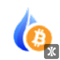

# logos

## source chain: sol
### ATLAS

### AURY

### RAY

### SBR

### SOL

### SRMso

### USDCso

### USDTso

### mSOL

## source chain: eth
### 1SOL

### AXSet

### BUSDet

### DAI

### DYDX

### ETH

### FRAX

### FTT

### FXS

### HBTC

### HUSD

### LDO

### LINK

### MANA

### MIMet

### ORION

### SAND

### SHIB

### SRMet

### SUSHI

### UNI

### USDCet

### USDK

### USDTet

### WBTC

### agEUR

### gOHM

### ibBTC

### stETH

## source chain: terra
### UST

### LUNA

## source chain: bsc
### BNB

### BUSDbs

### CAKE

### USDCbs

### USDTbs

## source chain: matic
### MATICpo

### USDCpo

### USDTpo

## source chain: avax
### AVAX

### JOE

### USDCav

